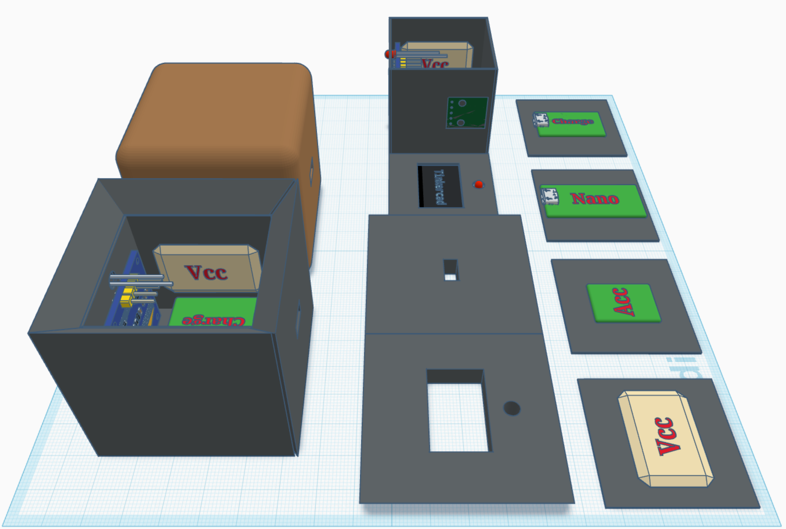
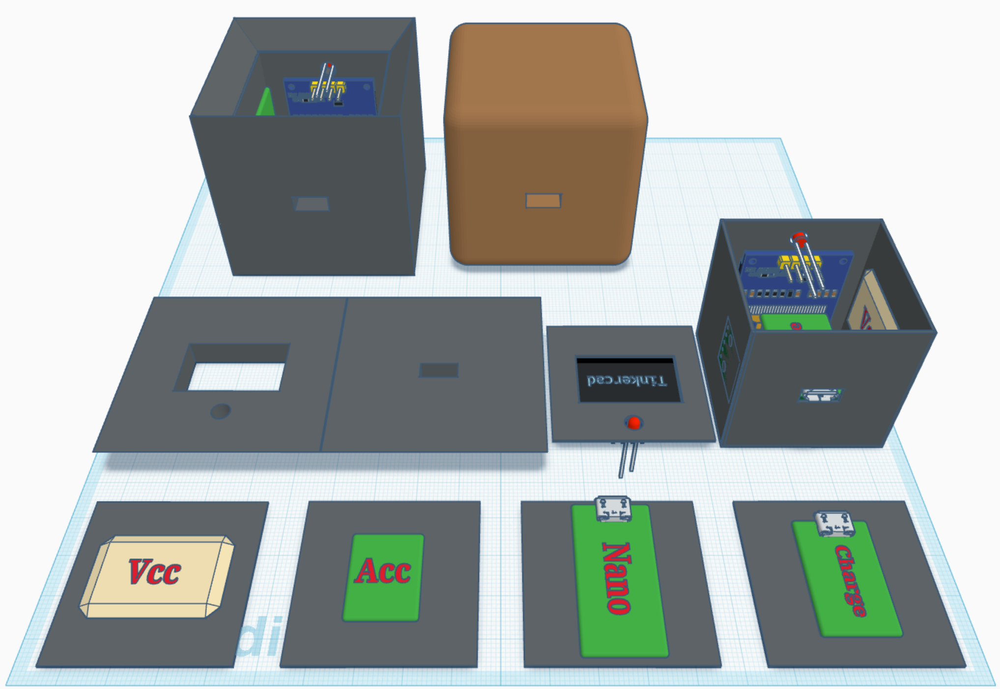
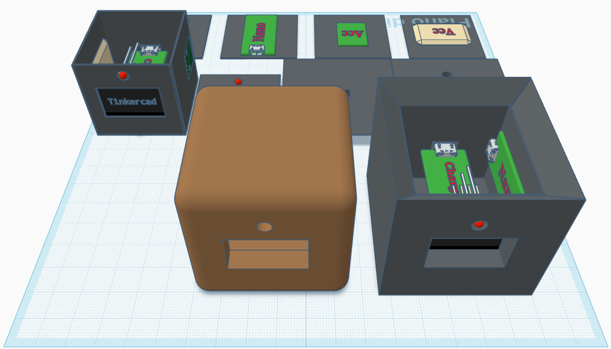
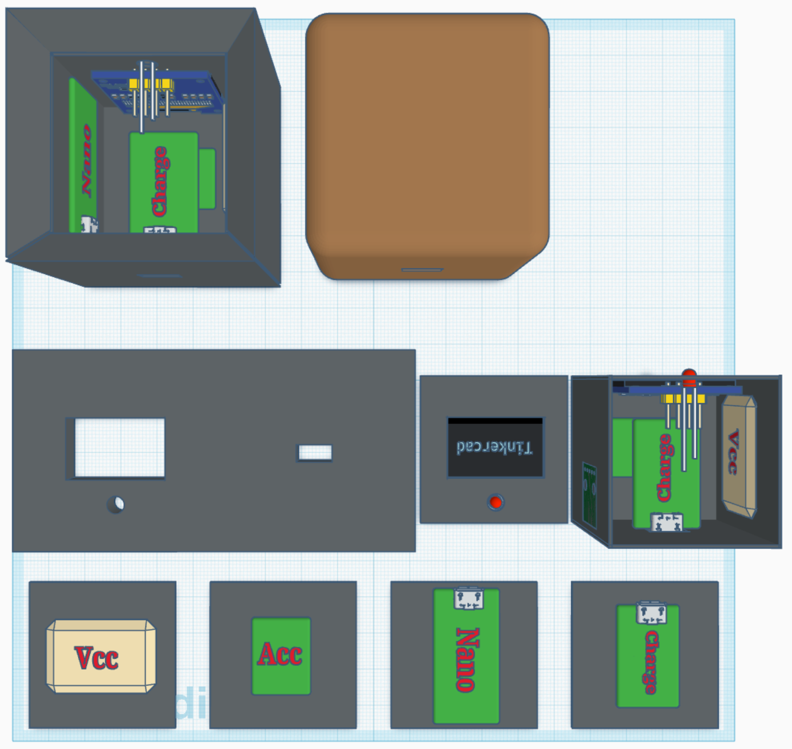

# 🍅 Pomodoro Gravity Cube

[](https://www.arduino.cc/)
[](https://isocpp.org/)
[](LICENSE)

A fully custom, Arduino-based physical Pomodoro timer with no buttons: the device reads its own orientation via an accelerometer, and flipping it to a different face starts a different countdown — built inside a handcrafted wooden shell.

## Table of Contents

- [Preview & Design](#preview--design)
- [Live Simulation](#live-simulation)
- [Features](#features)
- [Tech Stack / Hardware](#tech-stack--hardware)
- [Getting Started](#getting-started)
- [Usage](#usage)
- [Configuration / Environment](#configuration--environment)
- [Contributing](#contributing)
- [License](#license)

## Preview & Design

| 3D Model Overview | Panels & Exploded View |
| :---: | :---: |
|  |  |
| **Inner Core Details** | **Top-Down Layout** |
|  |  |

### Cube States & UI

| State / Face | Action & LED Feedback | UI Screenshot |
| :--- | :--- | :---: |
| **🎲⬆️ Timer Active** | Face 1/2/3/4 pointing up. Sets 5, 15, 25, or 45 mins. <br>🟢 **LED:** Green | ** |
| **🎲⚠️ Warning (30s left)** | Timer is almost up. <br>🟡 **LED:** Blinking Yellow | ** |
| **🎲🔔 Time's Up** | Countdown reaches `00:00`. <br>🔴 **LED:** Blinking Red | ** |
| **🎲⬇️ Pause** | Screen facing directly UP (Z-axis). <br>🔵 **LED:** Blue | ** |
| **🎲 Idle / Setup** | Cube hasn't been flipped yet. <br>⚫ **LED:** Off | ** |

## Live Simulation

Don't have the hardware yet? Test the exact code and logic directly in your browser via Wokwi:

👉 **[Run the Virtual Prototype on Wokwi](https://wokwi.com/projects/466522637641408513)**

*(Tip: in the simulation, click the switch to turn it on, then click the blue MPU6050 sensor to change the X/Y/Z axis and watch the screen and LED react.)*

## Features

- **Buttonless operation** — orientation is read directly from the MPU6050 accelerometer; no switches or inputs beyond the power slide switch
- Four preset countdowns mapped to cube faces: **5, 15, 25, and 45 minutes**
- Dedicated **pause face** (Z-axis up) that freezes the countdown without resetting it — flipping back to the same active face resumes exactly where it left off
- OLED display automatically rotates its content to match the physical orientation of the active face
- RGB LED status feedback: green while running, blinking yellow in the last 30 seconds, blinking red when time's up, blue when paused, off when idle
- Countdown logic is delta-time based (`millis()`), independent of loop execution speed

## Tech Stack / Hardware

**Firmware**
- **Language:** C++ (Arduino framework, `.ino` sketch)
- **Libraries:** `Wire.h`, `Adafruit_MPU6050`, `Adafruit_Sensor`, `Adafruit_GFX`, `Adafruit_SSD1306`

**Hardware components**
- Microcontroller: Arduino Nano / Pro Micro
- Motion Sensor: MPU6050 (6-axis Accelerometer & Gyroscope), I2C
- Display: SSD1306 OLED, 128×64, I2C
- Visual Feedback: 1× RGB LED (Common Cathode) + 3× 330Ω resistors
- Power Management: TP4056 LiPo Battery Charging Module
- Power Source: 3.7V LiPo Battery
- Misc: Slide switch, wiring, custom 3D-printed / wooden enclosure

## Getting Started

### Prerequisites

- [Arduino IDE](https://www.arduino.cc/en/software) (or PlatformIO)
- The hardware components listed above, wired according to the breadboard diagrams in `assets/`
- The following libraries installed via the Arduino Library Manager:
  - `Adafruit MPU6050`
  - `Adafruit Unified Sensor`
  - `Adafruit GFX Library`
  - `Adafruit SSD1306`

### Installation

**1. Clone the repository**

```bash
git clone https://github.com/mirconegri/PomodoroGravityCube.git
cd PomodoroGravityCube
```

**2. Wire the components**

Connect the MPU6050 and SSD1306 to the microcontroller's I2C bus (SDA/SCL), and the RGB LED to three PWM-capable digital pins through 330Ω resistors. Refer to the breadboard diagrams in `assets/` for the exact prototyping layout.

**3. Open and flash the sketch**

Open `src/cubo_pomodoro.ino` in the Arduino IDE, select your board and port, then upload.

## Usage

Once powered on and idle, place the cube on a flat surface and flip it onto one of its faces:

- **Face 1 / 2 / 3 / 4** → starts a 5 / 15 / 25 / 45-minute countdown respectively, shown on the OLED with the corresponding LED color
- **Face pointing straight up (Z-axis)** → pauses the currently running timer without losing progress
- Flip back to the previously active timer face to resume, or to a **different** face to start a fresh countdown
- When the countdown reaches zero, the display shows "FINITO!" and the LED blinks red until the cube is flipped again

## Configuration / Environment

This project has no software environment variables or `.env` file. All configuration is done in the firmware itself (`src/cubo_pomodoro.ino`):

| Constant / Pin | Purpose |
|---|---|
| `pinRosso`, `pinVerde`, `pinBlu` | Digital output pins driving the RGB LED (currently `5`, `6`, `9`) |
| Per-face timer durations | Set in the `switch (facciaAttuale)` block (5/15/25/45 minutes) |
| Acceleration threshold (`7.0`) | Sensitivity for detecting which face is pointing up — may need tuning based on mounting/calibration |

## Contributing

Contributions are welcome — whether firmware improvements, enclosure redesigns, or wiring alternatives:

1. Fork the repository
2. Create a feature branch (`git checkout -b feature/your-feature`)
3. Commit your changes with a clear message
4. Open a Pull Request

Found a bug or have an idea? Open an [Issue](https://github.com/mirconegri/PomodoroGravityCube/issues).

## License

This project is licensed under the **MIT License** — see the [LICENSE](LICENSE) file for details.
