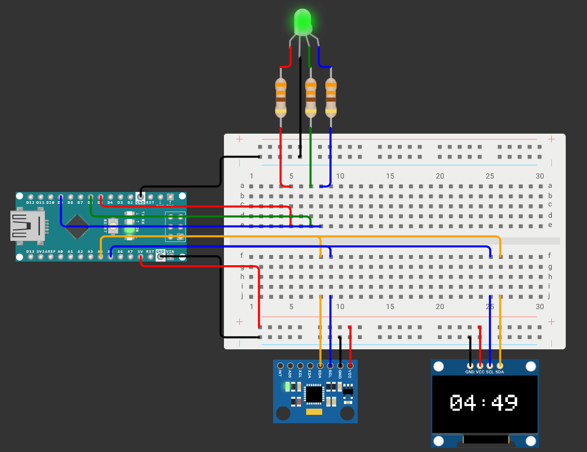
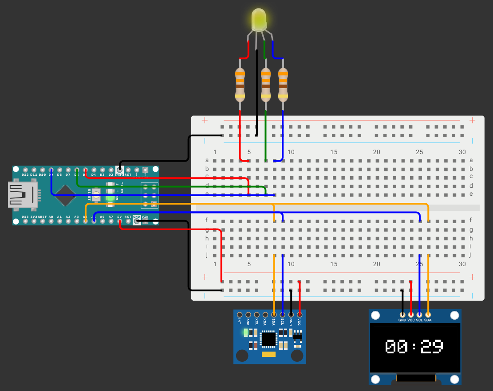
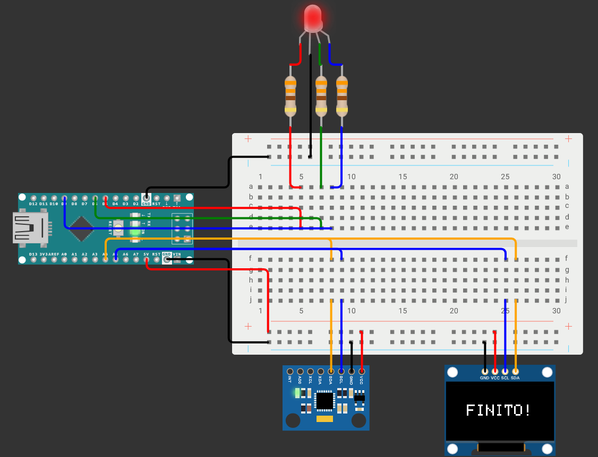
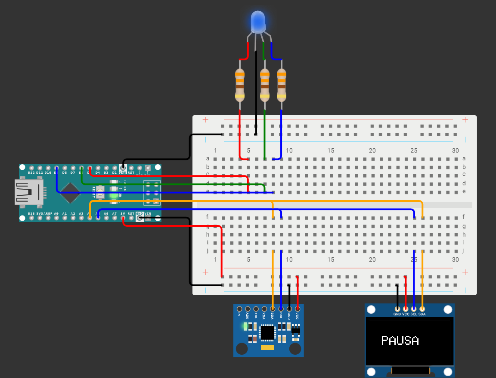
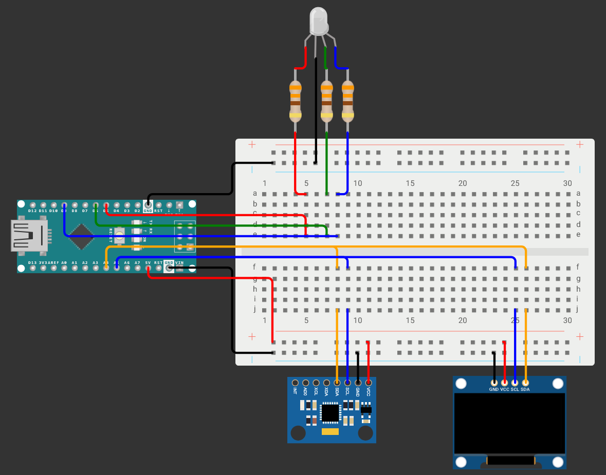

# 🍅 Pomodoro Gravity Cube

[](https://www.arduino.cc/) [](https://store.arduino.cc/) [](LICENSE) 

A fully custom, 100% Arduino-based physical Pomodoro timer controlled entirely by gravity. 

**The Backstory:** During my time at the student dorm, I had the amazing opportunity to join the local woodworking workshop ("Club del Legno"). I decided to combine my passion for coding and electronics with woodworking to build a smart, buttonless productivity cube. You simply flip it to different faces to start different timers!

---

## 🚀 Live Simulation

Don't have the hardware yet? You can test the exact code and logic of the Pomodoro Cube directly in your browser using my Wokwi interactive simulation:

👉 **[Run the Virtual Prototype on Wokwi](https://wokwi.com/projects/466522637641408513)**

*(Tip: In the simulation, click the switch to turn it on, then click on the blue MPU6050 sensor to change the X/Y/Z axis and watch the screen and LED react!)*

---

## 🛠️ Hardware Components

The core of the project is a 3D-printed inner chassis housed inside a handcrafted wooden shell. Here is the electronics list:

* **Microcontroller:** Arduino Nano / Pro Micro
* **Motion Sensor:** MPU6050 (6-axis Accelerometer & Gyroscope)
* **Display:** SSD1306 OLED Display (128x64, I2C)
* **Visual Feedback:** 1x RGB LED (Common Cathode) + 3x 330Ω Resistors
* **Power Management:** TP4056 LiPo Battery Charging Module
* **Power Source:** 3.7V LiPo Battery
* **Misc:** Slide Switch, wires, and custom 3D-printed/wooden enclosures.

---

## 📂 Struttura della Repository
Plaintext


```
Cubo-Timer-Pomodoro/
├── README.md                 
├── LICENSE                   
├── src/
│   └── cubo_pomodoro.ino      
└── assets/
    ├── hero-preview.gif       
    └── wiring-diagram.png     


```
---

## 📐 Design & Prototyping

Below are the 3D CAD designs for the internal structure and the outer wooden shell, along with the breadboard wiring diagrams used during the prototyping phase.

| 3D Model Overview | Panels & Exploded View |
| :---: | :---: |
|  |  |
| **Inner Core Details** | **Top-Down Layout** |
|  |  |
| **Final Wiring Diagram** | **Wiring with Switch** |
|  |  |

---

## 🎲 Cube States & UI

The MPU6050 reads the gravity vector and automatically adjusts the screen rotation and timer based on which face is pointing up.

| State / Face | Action & LED Feedback | UI Screenshot |
| :--- | :--- | :---: |
| **Timer Active** | Face 1/2/3/4 pointing up. Sets 5, 15, 25, or 45 mins. <br>🟢 **LED:** Green | ** |
| **Warning (30s left)**| Timer is almost up. <br>🟡 **LED:** Blinking Yellow | ** |
| **Time's Up** | Countdown reaches `00:00`. <br>🔴 **LED:** Blinking Red | ** |
| **Pause** | Screen facing directly UP (Z-axis). <br>🔵 **LED:** Blue | ** |
| **Idle / Setup** | Cube hasn't been flipped yet. <br>⚫ **LED:** Off | ** |


---

### 👤 Author & Connect

**Mirco Negri** — *Computer Science Student @ UniTrento*

### 📜 License

This project is licensed under the MIT License - see the [LICENSE](https://www.google.com/search?q=LICENSE) file for details.
